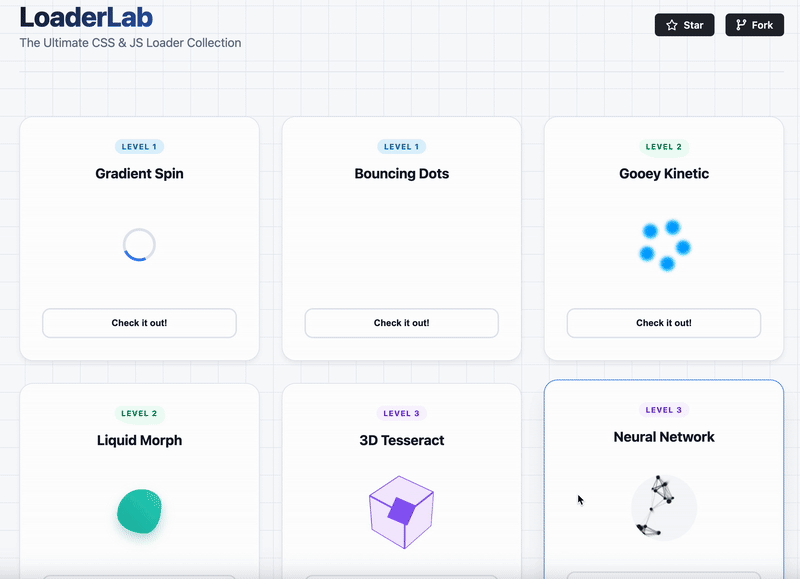

# ⚗️ LoaderLab: The Ultimate UI Showcase
[](https://buymeacoffee.com/quizmybrai7)

<div align="center">




**A curated collection of high-performance, tiered loading indicators ranging from pure CSS to HTML5 Canvas physics.**

[Live Demo](https://mariorazo97.github.io/loaderlab/) • [Features](#-features) • [Tech Stack](#-tech-stack)

</div>

---

## 🚀 Overview

LoaderLab is an interactive gallery designed to demonstrate the evolution of web animation techniques. It categorizes loading indicators into three distinct tiers of complexity, allowing developers to see the difference between simple CSS animations and complex JavaScript rendering.

It includes a **Persistent Voting System** using LocalStorage, allowing visitors to vote for their favorite animations.

## 🎨 The Tiers

### Level 1: The Classics (Pure CSS)
Simple, lightweight animations perfect for MVP products and minimalist designs.
* **Gradient Spin:** A modern take on the classic ring loader using CSS borders.
* **Bouncing Dots:** A staggered keyframe animation for waiting states.

### Level 2: Professional Polish (Advanced CSS)
High-end visual effects that utilize CSS Filters (`contrast` + `blur`) to create "impossible" shapes.
* **Gooey Kinetic:** Uses the "Gooey Effect" to make particles merge seamlessly.
* **Liquid Morph:** Uses `border-radius` manipulation to create a breathing, organic liquid shape.

### Level 3: God Mode (3D & Canvas)
Experimental rendering techniques that push the browser's capabilities.
* **3D Tesseract:** A CSS `preserve-3d` visualization of a hypercube rotation.
* **Neural Network:** An HTML5 Canvas particle system with proximity detection and dynamic line drawing.

---

## 🛠️ Tech Stack & Techniques

* **Architecture:** Single-File Component (HTML/CSS/JS all in one for portability).
* **CSS Architecture:**
    * CSS Grid Layout.
    * CSS Variables for theming.
    * Hardware Acceleration (`transform: translateZ(0)`) for 60FPS performance.
* **JavaScript:**
    * `LocalStorage` API for persisting vote data.
    * `requestAnimationFrame` for optimized Canvas rendering.
    * ES6 Classes for the particle system.

---

## 📦 Installation

This project is zero-dependency. You can run it anywhere.

1.  **Clone the repo**
    ```bash
    git clone [https://github.com/mariorazo97/loaderlab.git](https://github.com/mariorazo97/loaderlab.git)
    ```
2.  **Open `index.html`** in your browser.

---

## 🤝 Contributing

Feel free to fork this repository and add your own loaders!
1.  Fork the Project
2.  Create your Feature Branch (`git checkout -b feature/AmazingLoader`)
3.  Commit your Changes (`git commit -m 'Add some AmazingLoader'`)
4.  Push to the Branch (`git push origin feature/AmazingLoader`)
5.  Open a Pull Request

---

<div align="center">

**Created by Mario Oscar Pureco-Razo**

If you found this useful or cool, please give it a ⭐!

</div>

## ☕ Support the Project

If you found this tool useful, you can buy me a coffee to keep me awake while I code the next feature!

<a href="https://buymeacoffee.com/quizmybrai7">
  
</a>
